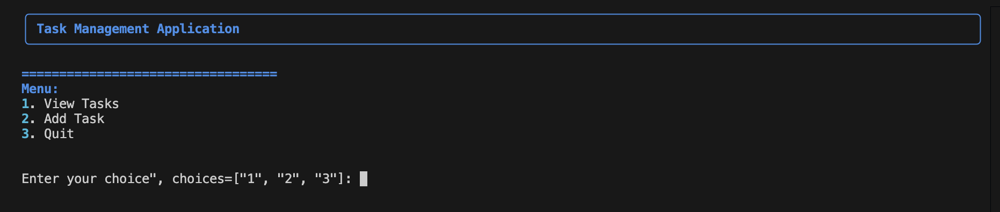

# Task Manager Application



## Overview

The Task Manager is a command-line application built in Python to help users manage tasks efficiently. It provides features to view, add, and save tasks with a user-friendly interface powered by the `rich` library. The application includes logging for debugging and monitoring, configuration management, and unit tests to ensure reliability.

- **Author**: GowerCampbell
- **Date**: Feb 25, 2025
- **Version**: 1.0.0

## Project Structure

The project directory structure is as follows (based on the provided screenshot):

```
TaskManager/
├── __pycache__/
├── tasks_data/
├── tests/
├── __init__.py
├── app.log
├── business_logic.py
├── config.json
├── config.py
├── constants.py
├── data_access.py
├── main.py
├── models.py
├── README.md
├── requirements.txt
├── task_manager.log
├── user_interface.py
└── utilities.py
```

- `__pycache__`: Contains compiled Python bytecode files.
- `tasks_data/`: Directory for storing task data (e.g., `tasks.json`).
- `tests/`: Contains unit tests for the application.
- `__init__.py`: Marks the directory as a Python package.
- `app.log` and `task_manager.log`: Log files for tracking application events.
- Other `.py` files: Core modules for business logic, data access, configuration, user interface, utilities, and models.
- `config.json`: Configuration file for application settings.
- `README.md`: This file.
- `requirements.txt`: List of project dependencies.

## Features

- **View Tasks**: Display all tasks in a formatted table.
- **Add Tasks**: Add new tasks with titles and descriptions.
- **Persistence**: Tasks are saved to a JSON file (`tasks.json`) for persistence.
- **Logging**: Tracks application events and errors for debugging.
- **User Interface**: Enhanced CLI interface using the `rich` library.
- **Validation**: Enforces constraints (e.g., maximum task description length of 100 characters).
- **Testing**: Includes unit tests for the `TaskService` class.

## Installation

1. **Clone the Repository**:
   ```bash
   git clone <repository-url>
   cd TaskManager
   ```

2. **Install Dependencies**:
   Ensure you have Python 3.8+ installed. Install the required packages using:
   ```bash
   pip install -r requirements.txt
   ```

3. **Configure the Application**:
   - Edit `config.json` to customize settings (e.g., logging, data file location).
   - Example `config.json` structure:
     ```json
     {
       "data_folder": "tasks_data",
       "data_file": "tasks.json",
       "task_max_length": 100,
       "logging": {
         "enabled": true,
         "log_file": "task_manager.log",
         "log_level": "INFO"
       }
     }
     ```

4. **Run the Application**:
   ```bash
   python main.py
   ```

## Usage

### Running the Application

- Start the application by running `python main.py`.
- The main menu will display the following options:
  1. **View Tasks**: Displays all tasks in a table.
  2. **Add Task**: Prompts for a title and description to add a new task.
  3. **Quit**: Exits the application.

### Example Log Output

The application logs key events to `task_manager.log`. Recent log entries include:

```
2025-03-05 14:54:18 - INFO - Retrieved 1 tasks from tasks_data/tasks.json
2025-03-05 14:54:18 - INFO - Retrieved 1 tasks.
2025-03-05 14:54:18 - INFO - Displayed tasks.
2025-03-10 12:44:16 - INFO - Logging initialized.
2025-03-10 12:44:16 - INFO - Task Manager application started.
2025-03-10 12:44:16 - INFO - TaskService initialized.
2025-03-10 12:44:29 - INFO - Retrieved 1 tasks from tasks_data/tasks.json
2025-03-10 12:44:29 - INFO - Retrieved 1 tasks.
2025-03-10 12:44:29 - INFO - Displayed tasks.
2025-03-10 12:44:42 - INFO - Retrieved 1 tasks from tasks_data/tasks.json
2025-03-10 12:44:42 - INFO - Retrieved 1 tasks.
2025-03-10 12:44:42 - INFO - Displayed tasks.
2025-03-10 12:45:08 - INFO - Retrieved 1 tasks from tasks_data/tasks.json
2025-03-10 12:45:08 - INFO - Saved task: Hello World!: This is a new Task!
2025-03-10 12:45:08 - INFO - Added task: Hello World!: This is a new Task!
2025-03-10 12:45:08 - INFO - User added task: Hello World! - This is a new Task!
2025-03-10 12:45:34 - INFO - User exited the application.
```

### Example Workflow

1. Run the application.
2. Choose option `1` to view existing tasks.
3. Choose option `2` to add a task (e.g., "Hello World!" with description "This is a new Task!").
4. Choose option `1` again to verify the new task is displayed.
5. Choose option `3` to exit.

## Testing

Unit tests are located in the `tests/` directory. To run the tests:

```bash
python3 -m unittest tests/tests.py
```

The test suite includes checks for:
- Adding valid tasks.
- Handling tasks exceeding the maximum length.
- Retrieving all tasks.
- Adding empty tasks.
- Handling duplicate tasks.
- Task persistence across service instances.

If all tests pass, you will see a confirmation message (e.g., "Ran 7 tests in X.XXs OK").

## Contributing

1. Fork the repository.
2. Create a new branch (`git checkout -b feature-branch`).
3. Make your changes and commit them (`git commit -m "Description of changes"`).
4. Push to the branch (`git push origin feature-branch`).
5. Open a pull request.

## License

This project is licensed under the MIT License. See the `LICENSE` file for details (if applicable).

## Acknowledgements

- **Rich Library**: For providing an enhanced terminal interface. [Documentation](https://rich.readthedocs.io)
- **Python Community**: For extensive documentation and resources. [Python Docs](https://docs.python.org/3/)
- **Real Python**: For articles on logging and validation. [Real Python](https://realpython.com/)
- **MDN Web Docs**: For JSON configuration insights. [MDN JSON](https://developer.mozilla.org/en-US/docs/Learn/JavaScript/Objects/JSON)

## Contact

For questions or feedback, please contact GowerCampbell via the repository issues page.
